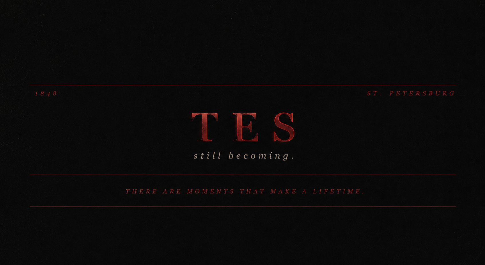
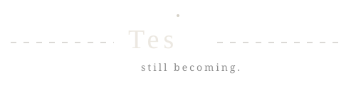

<div align="center">



<br>

# Tes

### *still becoming.*


</div>

> *“The mystery of human existence lies not in just staying alive, but in finding something to live for.”*  
> — **Fyodor Dostoevsky**

---

## Current Chapter

```text
Building

→ ShellForge

Learning

→ Operating Systems
→ Distributed Systems

Reading

→ White Nights
→ The Brothers Karamazov

Writing

→ The Darkest Sun
→ The Quietest Wound
```

---

## Fragment

> Every answer deserves a quieter question.

---

## Selected Works

<table>
<tr>
<td width="50%">

### ShellForge

A Unix shell built to understand the conversation between humans and machines.

</td>

<td width="50%">

### Stock Screener

An attempt to replace noise with clarity.

</td>
</tr>

<tr>
<td width="50%">

### The Darkest Sun

A story about what remains when hope becomes difficult.

</td>

<td width="50%">

### The Quietest Wound

Fiction shaped by memory, silence, and longing.

</td>
</tr>
</table>

---

## Notes

```text
Learn deeply.

Build patiently.

Write honestly.

Leave every version better than the last.
```

---

<div align="center">


<br><br>

<picture>
  <source media="(prefers-color-scheme: dark)" srcset="https://raw.githubusercontent.com/Tejes-alt/Tejes-alt/output/github-contribution-grid-snake-dark.svg">
  <source media="(prefers-color-scheme: light)" srcset="https://raw.githubusercontent.com/Tejes-alt/Tejes-alt/output/github-contribution-grid-snake.svg">
  
</picture>

<br><br>



<br>

*let it happen.*

</div>