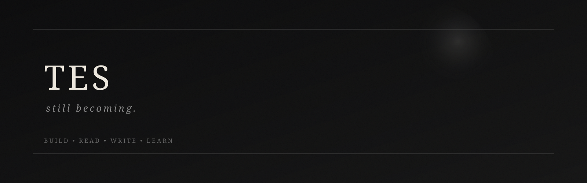

 

# Tes

still becoming.

 

<picture>
  <source
    media="(prefers-color-scheme: dark)"
    srcset="https://raw.githubusercontent.com/Tejes-alt/Tejes-alt/output/github-contribution-grid-snake-dark.svg">
  <source
    media="(prefers-color-scheme: light)"
    srcset="https://raw.githubusercontent.com/Tejes-alt/Tejes-alt/output/github-contribution-grid-snake.svg">
  
</picture>

